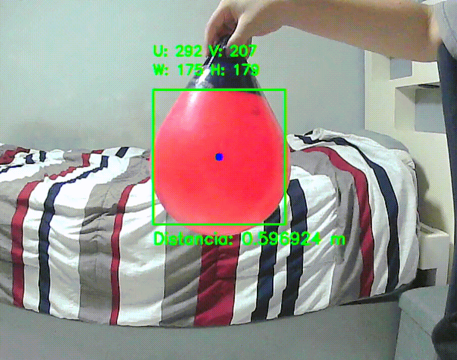

# VantTEC USV - OpenLab 2026

<p align="center">

  

  

  

  

  

</p>

---

## Overview

Este repositorio contiene el desarrollo del sistema de visión para el **OpenLab de USV de VantTEC**, desarrollado en **C++ y OpenCV** para ejecutarse en una **Raspberry Pi**.

El sistema utiliza una cámara para capturar imágenes en tiempo real y aplicar técnicas de **visión por computadora** para detectar objetos de interés, determinar su posición y estimar su profundidad o distancia.

El proyecto se ejecuta mediante **Docker**, permitiendo mantener las dependencias necesarias dentro del contenedor y facilitando su ejecución en la Raspberry Pi.

<p align="center">  </p>

---

## System

El sistema está diseñado para:

* Obtener imágenes en tiempo real desde una cámara.
* Procesar las imágenes utilizando OpenCV.
* Analizar información de color y características de la imagen.
* Detectar objetos de interés mediante procesamiento de imágenes.
* Extraer características del objeto detectado, como posición, área y dimensiones.
* Estimar la profundidad o distancia del objeto a partir de la información obtenida.
* Ejecutar el procesamiento dentro de un contenedor Docker.
* Permitir la calibración de los valores de color utilizados por el sistema.

---

## Color Calibration

El proyecto incluye una herramienta independiente para realizar la **calibración de color**.

Esta herramienta permite visualizar la cámara y ajustar los valores utilizados para la detección de color.

### Features

* Ajuste de valores de color.
* Visualización de la cámara en tiempo real.
* Pruebas de diferentes valores de segmentación.
* Obtención de parámetros para utilizar posteriormente en el sistema principal.

La herramienta puede ejecutarse mediante:

```bash
./runCalibration.sh
```

---

## Requirements

### Hardware

* Raspberry Pi.
* Cámara.

### Software

* Raspberry Pi OS.
* Docker.
* Git.

El proyecto utiliza Docker para proporcionar las dependencias necesarias para compilar y ejecutar el sistema.

---

## Camera Setup

Antes de ejecutar el proyecto, es necesario comprobar que la Raspberry Pi detecta correctamente la cámara.

Ejecutar:

```bash
ls /dev/video*
```

La cámara utilizada por el proyecto debe estar disponible como un dispositivo de video, normalmente:

```text
/dev/video0
```

---

## Installation

Clonar el repositorio:

```bash
git clone https://github.com/robberto-carlo/vanttec-USV-OpenLab-2026.git
```

Entrar al directorio del proyecto:

```bash
cd vanttec-USV-OpenLab-2026
```

---

## Docker

El proyecto utiliza Docker para crear el entorno de compilación y ejecución.

### Build

Construir la imagen:

```bash
sudo docker build -t vanttec-usv .
```

Este comando debe ejecutarse desde la carpeta principal del repositorio.

La imagen contiene las dependencias necesarias para compilar el proyecto, incluyendo:

* C++
* CMake
* OpenCV

---

## Running the System

Una vez construida la imagen de Docker, el sistema puede ejecutarse mediante el script:

```bash
./run.sh
```

Este script configura automáticamente:

* Acceso a la cámara.
* Comunicación con el entorno gráfico de Raspberry Pi.
* Ejecución del programa principal.

El ejecutable utilizado es:

```text
build/vanttecUSV
```

### Stop

Para detener el programa:

**Presiona `ESC` mientras la ventana de OpenCV está activa.**

---

## Running Color Calibration

Para ejecutar el programa de calibración:

```bash
./runCalibration.sh
```

Este script utiliza la misma imagen Docker, pero ejecuta el programa:

```text
build/calibrarColor
```

Para detener la calibración:

**Presiona `ESC` mientras la ventana de OpenCV está activa.**

---

## Repository Structure

```text
vanttec-USV-OpenLab-2026/
│
├── assets/
│   └── object_detection.gif
├── docs/
│   └── documentation.pdf
│
├── src/
│   ├── main.cpp
│   ├── Vision.cpp
│   └── calibrarColor.cpp
│
├── include/
│   └── Vision.hpp
│
├── CMakeLists.txt
├── CMakePresets.json
├── Dockerfile
│
├── run.sh
├── runCalibration.sh
└── README.md
```

---

## Technologies

* **C++**
* **OpenCV**
* **CMake**
* **Docker**
* **Raspberry Pi OS**
* **Git / GitHub**

---


## Developer

<p align="center">

<strong>Roberto Carlo Ponce de León Ruvalcaba</strong><br> <em>Computer Vision & C++ Development</em></p>

